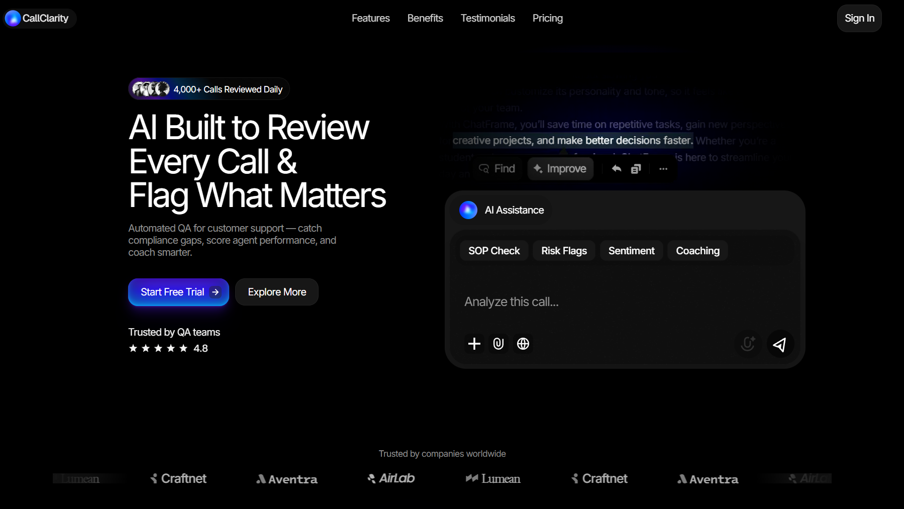

# CallClarity — AI Analysis Platform for Customer Support Templete



AI that reviews all support conversations, checks SOP compliance, flags risks, and automates QA.

**Tech Stack:** Next.js • React • Tailwind CSS • Framer Motion • TypeScript

⚠️ **IMPORTANT NOTICE:** This project is **NOT** a template for sale. It is completely free and open-source. Please ensure you provide proper credit to the original creators and developers when using or sharing this codebase. 

## Key Features

- **SOP Adherence:** Automatically verify if agents are following standard operating procedures.
- **Risk Detection:** Identify compliance risks, missed disclosures, and risky statements in real-time.
- **100% QA Coverage:** Eliminate manual sampling by reviewing every single interaction.
- **Agent Coaching:** Get data-driven insights to coach agents and improve performance.

## Getting Started

1. Clone the repository
```bash
git clone <repository-url>
```

2. Install dependencies
```bash
npm install
```

3. Run the development server
```bash
npm run dev
```

4. Open [http://localhost:3000](http://localhost:3000) in your browser

## Credits

**Original Design Inspiration:** Created by [@ItsPeterDesign](https://x.com/ItsPeterDesign)  
**Inspired by:** [Chatframe Template](https://www.framer.com/marketplace/templates/chatframe/)

This project is a custom Next.js implementation developed to provide a high-performance, accessible version of the CallClarity landing page.

## Developer

**Developed by:** [@Ethan4582](https://github.com/Ethan4582)  
**Contact:** [@SinghAshir65848](https://x.com/SinghAshir65848)

## ☕ Support the Creator

If you find this project useful, consider supporting us!  
Your contribution helps in the development and maintenance of high-quality open-source projects.

[](https://buymeacoffee.com/ashirwad05) [Buy Me a Coffee](https://buymeacoffee.com/ashirwad05)

## License

This project is open-source. Please credit the developers and the original designer when using this work.

---
*Empowering support teams with clarity through AI.*